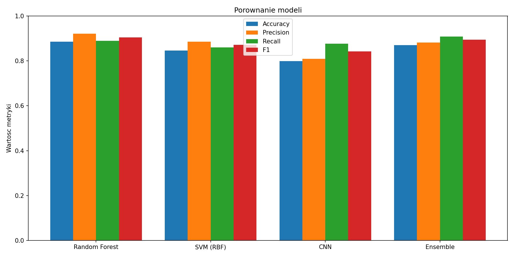

# Klasyfikacja ADHD na podstawie sygnałów EEG

Binarny klasyfikator diagnozujący ADHD na podstawie wielokanałowych sygnałów EEG (19 kanałów, system 10-20).

Projekt zrealizowany w ramach rekrutacji do sekcji AI KN Neuron (Wiosna 2026).

## Struktura projektu

```
adhd-eeg-classifier/
├── data/
│   └── adhdata.csv              # dane EEG (Kaggle)
├── notebooks/
│   └── eda.ipynb                # eksploracyjna analiza danych (EDA)
├── src/
│   ├── __init__.py              # oznaczenie pakietu Python
│   ├── data_loader.py           # ładowanie CSV, filtracja pasmowa, segmentacja na epoki
│   ├── features.py              # ekstrakcja cech (statystyczne, częstotliwościowe, Hjorth, nieliniowe, cross-channel)
│   ├── model.py                 # definicje modeli (RF, SVM, CNN)
│   ├── train.py                 # trening, cross-validation, augmentacja danych
│   └── evaluate.py              # metryki, confusion matrix, ROC, porównanie modeli
├── results/                     # wykresy i zapisane modele (generowane automatycznie)
├── main.py                      # główny pipeline
├── requirements.txt
└── README.md
```

## Uruchomienie

```bash
# 1. Klonowanie repozytorium
git clone https://github.com/krzyniuczacha/adhd-eeg-classifier.git
cd adhd-eeg-classifier

# 2. Utworzenie środowiska wirtualnego
python -m venv .venv
.venv\Scripts\activate        # Windows
# source .venv/bin/activate   # Linux/Mac

# 3. Instalacja zależności
pip install -r requirements.txt

# 4. Pobranie danych
# Pobierz zbiór z https://www.kaggle.com/datasets/danizo/eeg-dataset-for-adhd/data
# i umieść plik adhdata.csv w folderze data/

# 5. Uruchomienie
python main.py
```

Wyniki (wykresy, confusion matrix, krzywe ROC) zostaną zapisane w folderze `results/`.

## Pipeline

### 1. Ładowanie i preprocessing danych

- Usuwanie duplikatów, uzupełnianie braków medianą
- **Filtr pasmowy Butterwortha** (0.5–40 Hz, rząd 4) — usuwa drift (<0.5 Hz) i artefakty mięśniowe (>40 Hz)
- **Segmentacja na epoki** — 2-sekundowe okna (256 próbek przy fs=128 Hz)

### 2. Ekstrakcja cech

Dla każdej epoki i każdego z 19 kanałów EEG wyznaczane są cechy z czterech kategorii:

| Kategoria | Cechy | Uzasadnienie |
|-----------|-------|--------------|
| **Statystyczne** | mean, std, variance, skew, kurtosis, min, max, peak-to-peak, RMS, zero crossings | Podstawowy opis rozkładu amplitudy sygnału |
| **Częstotliwościowe** (Welch PSD) | Moc absolutna i relatywna w pasmach delta/theta/alpha/beta/gamma, theta/beta ratio, theta/alpha ratio, spectral slope, spectral entropy | Theta/beta ratio jest kluczowym biomarkerem ADHD — podwyższone theta i obniżone beta |
| **Hjorth** | Activity, Mobility, Complexity | Klasyczne cechy EEG: moc sygnału, dominująca częstotliwość, zmienność częstotliwości |
| **Nieliniowe** (antropy) | Sample entropy, permutation entropy, approximate entropy, Higuchi FD, Katz FD, DFA | Złożoność i regularność sygnału — ADHD wiąże się ze zmienioną dynamiką nieliniową |

Dodatkowo cechy **cross-channel**:
- Statystyki macierzy korelacji (mean, std, min, max)
- **Asymetria międzypółkulowa** — ogólna i per pasmo (theta/alpha) dla 8 par elektrod (Fp1-Fp2, F3-F4, C3-C4, P3-P4, O1-O2, F7-F8, T7-T8, P7-P8)

**Selekcja cech:** `SelectFromModel` z Random Forest (próg: 75. percentyl ważności) — redukcja z ~690 do ~170 najistotniejszych cech.

### 3. Podział danych

**Subject Split** (`GroupShuffleSplit`, 80/20) — dane tego samego pacjenta **nigdy** nie trafiają jednocześnie do zbioru treningowego i testowego. Zapobiega to data leakage i zapewnia rzetelną ocenę generalizacji modelu.

### 4. Modele

Porównanie czterech podejść:

**Random Forest** (scikit-learn)
- 1000 drzew, `class_weight='balanced'`, OOB score
- Cross-validation: `StratifiedGroupKFold` (5 foldów z grupami pacjentów)

**SVM z jądrem RBF** (scikit-learn)
- `C=10.0, gamma=0.01`, zbalansowane wagi klas
- Cross-validation jak wyżej

**1D CNN** (PyTorch)
- 3 bloki konwolucyjne (32→64→64 filtrów) na surowych sygnałach EEG (19×256)
- Szerokie filtry w pierwszej warstwie (kernel=15) wyłapują wolne oscylacje delta/theta
- Augmentacja: szum gaussowski, przesunięcia czasowe, skalowanie amplitudy, channel dropout
- Label smoothing, BCEWithLogitsLoss z wagami klas, AdamW + CosineAnnealingWarmRestarts
- Early stopping z patience=15

**Ensemble** (Soft Voting)
- Ważona średnia prawdopodobieństw: 45% RF + 30% SVM + 25% CNN
- Wagi dobrane proporcjonalnie do jakości poszczególnych modeli

### 5. Ewaluacja

- **Metryki:** Accuracy, Precision, Recall, F1-score, Classification Report
- **Wizualizacje:** Confusion Matrix, krzywa ROC z AUC, wykres porównawczy modeli, feature importance
- **Agregacja na poziomie pacjenta** — uśrednienie prawdopodobieństw po epokach danego pacjenta, próg 0.5

## Wyniki

| Model | Accuracy | Precision | Recall | F1 |
|-------|----------|-----------|--------|----|
| Random Forest | 0.88 | 0.92 | 0.88 | 0.90 |
| SVM (RBF) | 0.84 | 0.90 | 0.84 | 0.87 |
| CNN | 0.82 | 0.81 | 0.91 | 0.86 |
| Ensemble | **0.89** | **0.92** | **0.89** | **0.90** |

Predykcja na poziomie pacjenta (Ensemble): **accuracy 0.88**, F1 0.89 na 25 pacjentach testowych.



### Wnioski

- **Random Forest** osiągnął najlepsze wyniki spośród pojedynczych modeli (F1=0.90). Cechy ręcznie zaprojektowane (theta/beta ratio, entropia, asymetria) okazały się skuteczniejsze niż surowe sygnały podawane do CNN.
- **SVM** wypada nieznacznie słabiej niż RF — prawdopodobnie z powodu dużej liczby cech (>150), gdzie drzewa decyzyjne radzą sobie lepiej niż kernel RBF.
- **CNN** ma najwyższy recall (0.91) — rzadziej przegapia ADHD — ale kosztem precision. Overfitting pozostaje wyzwaniem przy małym zbiorze (~6700 epok treningowych). Augmentacja (szum, time shift, channel dropout) złagodziła problem, ale go nie wyeliminowała.
- **Ensemble** łączy zalety wszystkich modeli i osiąga najlepszy balans metryk. Wysoki recall CNN kompensuje konserwatywność RF/SVM.
- **Najważniejsze cechy** to theta/beta ratio, spectral entropy i asymetria międzypółkulowa w paśmie theta — co jest zgodne z literaturą kliniczną dot. ADHD.
- Cross-validation z grupami pacjentów pokazuje dużą wariancję między foldami (acc 0.70–0.82), co sugeruje znaczną zmienność międzyosobniczą w sygnałach EEG.

## Technologie

- Python 3.13
- PyTorch (CNN)
- scikit-learn (Random Forest, SVM, preprocessing)
- SciPy (filtracja sygnału, analiza częstotliwościowa)
- antropy (cechy nieliniowe EEG)
- matplotlib / seaborn (wizualizacje)
- Jupyter Notebook (EDA)
